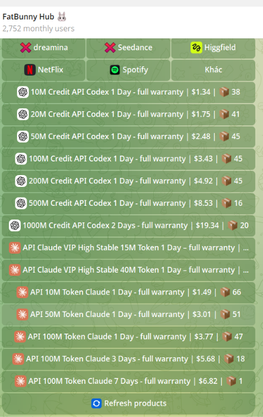

# 🎯 AI HUNTING SETUP

Hey guys, it's **cypherbinu** 👋

This repository is very helpful for bug bounty hunters who want to use AI for their hunting workflow without wasting money on expensive AI tokens.

I've shared some useful and secret methodologies here that can help you use AI at a much lower cost while improving your hunting efficiency.

## 📚 About This Repository

This is a **comprehensive resource for AI-powered bug bounty hunting**. Here you'll find:

- 🔧 **Setup guides** for configuring Claude Code with various API providers
- 🎯 **Hunting methodologies** optimized for efficiency and cost reduction
- 💡 **Different hunting skills and techniques** to improve your workflow
- 🤖 **AI integration examples** for various security testing scenarios

**New hunting skills and methodologies are being added regularly**, so make sure to check back and explore the different directories and files in this repository to find useful techniques for your specific hunting goals.

With the right AI setup, you can:

- ⚡ Speed up your recon and analysis
- 🔎 Find potential bugs faster
- 🤖 Use AI effectively during your hunting workflow
- 💰 Reduce unnecessary AI token costs
- 🧠 Improve your overall bug bounty workflow

The goal is simple: **spend less on AI and hunt smarter.**

> Use these methods only on programs and targets where you have permission to test.

---

## 🛠️ Prerequisites

Ensure you have **Node.js (v18 or higher)** installed on your system.

Install Claude Code globally via NPM:

```bash
npm install -g @anthropic-ai/claude-code
```

> **Note:** Use `sudo` on Linux/macOS if you encounter permission errors.

---

# ⚡ Configuration & Setup

You can configure Claude Code using either **AgentRouter** or **Nghimmo API**.

Choose the method you want to use and follow the corresponding setup instructions.

---

# 🔹 Method 1 — AgentRouter

AgentRouter allows Claude Code to connect through a custom API endpoint.

📖 **Documentation:** [AgentRouter API](https://agentrouter.org)

## 🪟 Windows — Command Prompt / PowerShell

Run:

```powershell
setx ANTHROPIC_BASE_URL "https://agentrouter.org"
setx ANTHROPIC_AUTH_TOKEN "YOUR_AGENTROUTER_API_KEY"
setx ANTHROPIC_MODEL "claude-opus-4-6"
setx CLAUDE_CODE_USE_AUTH_TOKEN "true"
```

After running the commands, **restart your terminal**.

---

## 🐧 Linux — Bash / Zsh

### Zsh

```bash
echo 'export ANTHROPIC_BASE_URL="https://agentrouter.org"' >> ~/.zshrc
echo 'export ANTHROPIC_AUTH_TOKEN="YOUR_AGENTROUTER_API_KEY"' >> ~/.zshrc
echo 'export ANTHROPIC_MODEL="claude-opus-4-6"' >> ~/.zshrc
echo 'export CLAUDE_CODE_USE_AUTH_TOKEN="true"' >> ~/.zshrc

source ~/.zshrc
```

### Bash

```bash
echo 'export ANTHROPIC_BASE_URL="https://agentrouter.org"' >> ~/.bashrc
echo 'export ANTHROPIC_AUTH_TOKEN="YOUR_AGENTROUTER_API_KEY"' >> ~/.bashrc
echo 'export ANTHROPIC_MODEL="claude-opus-4-6"' >> ~/.bashrc
echo 'export CLAUDE_CODE_USE_AUTH_TOKEN="true"' >> ~/.bashrc

source ~/.bashrc
```

---

## 📝 AgentRouter — Demo Configuration Example

Here's a complete demo configuration (using placeholder values):

```bash
# Added by AgentRouter CLI installer
export ANTHROPIC_BASE_URL="https://agentrouter.org"
export ANTHROPIC_AUTH_TOKEN="sk-demo1234567890abcdefghijklmnopqr"
export ANTHROPIC_MODEL="deepseek-v4-flash"
export CLAUDE_CODE_USE_AUTH_TOKEN="true"
export CLAUDE_CODE_DISABLE_NONESSENTIAL_TRAFFIC="1"
```

> ⚠️ **Important:** Replace `sk-demo1234567890abcdefghijklmnopqr` with your **actual AgentRouter API key**. Never commit real keys to version control.

---

# 🔹 Method 2 — Nghimmo API

Nghimmo provides an Anthropic-compatible API endpoint that can be used with Claude Code.

📖 **Documentation:** [Nghimmo API Guide](https://api.nghimmo.com/huongdan)

### Base URL

```text
https://api.nghimmo.com
```

## 🪟 Windows — Command Prompt / PowerShell

Run:

```powershell
setx ANTHROPIC_BASE_URL "https://api.nghimmo.com"
setx ANTHROPIC_AUTH_TOKEN "YOUR_NGHIMMO_API_KEY"
setx ANTHROPIC_MODEL "claude-opus-4-6"
setx CLAUDE_CODE_USE_AUTH_TOKEN "true"
```

After running the commands, **restart your terminal**.

---

## 🐧 Linux — Bash / Zsh

### Zsh

```bash
echo 'export ANTHROPIC_BASE_URL="https://api.nghimmo.com"' >> ~/.zshrc
echo 'export ANTHROPIC_AUTH_TOKEN="YOUR_NGHIMMO_API_KEY"' >> ~/.zshrc
echo 'export ANTHROPIC_MODEL="claude-opus-4-6"' >> ~/.zshrc
echo 'export CLAUDE_CODE_USE_AUTH_TOKEN="true"' >> ~/.zshrc

source ~/.zshrc
```

### Bash

```bash
echo 'export ANTHROPIC_BASE_URL="https://api.nghimmo.com"' >> ~/.bashrc
echo 'export ANTHROPIC_AUTH_TOKEN="YOUR_NGHIMMO_API_KEY"' >> ~/.bashrc
echo 'export ANTHROPIC_MODEL="claude-opus-4-6"' >> ~/.bashrc
echo 'export CLAUDE_CODE_USE_AUTH_TOKEN="true"' >> ~/.bashrc

source ~/.bashrc
```

> **Important:** Replace `YOUR_NGHIMMO_API_KEY` with your actual Nghimmo API key.

---

# 🔄 Switching Between AgentRouter and Nghimmo

Claude Code uses the following environment variables:

```text
ANTHROPIC_BASE_URL
ANTHROPIC_AUTH_TOKEN
ANTHROPIC_MODEL
CLAUDE_CODE_USE_AUTH_TOKEN
```

To switch from **AgentRouter** to **Nghimmo**, change the Base URL and API key.

### AgentRouter

```bash
export ANTHROPIC_BASE_URL="https://agentrouter.org"
export ANTHROPIC_AUTH_TOKEN="YOUR_AGENTROUTER_API_KEY"
```

### Nghimmo

```bash
export ANTHROPIC_BASE_URL="https://api.nghimmo.com"
export ANTHROPIC_AUTH_TOKEN="YOUR_NGHIMMO_API_KEY"
```

Then reload your shell:

```bash
source ~/.bashrc
```

or:

```bash
source ~/.zshrc
```

---

# 🤖 Model Configuration

The model can be changed using:

```bash
export ANTHROPIC_MODEL="claude-opus-4-6"
```

Make sure the selected model is supported by the API provider you are using.

---

# 🚀 Launching Claude Code

Once the configuration is complete, navigate to your project directory:

```bash
cd /path/to/your/project
```

Then start Claude Code:

```bash
claude
```

Claude Code will use the API endpoint, authentication token, and model configured in your environment variables.

---

# 🔍 Check Your Configuration

You can verify that the variables are set:

```bash
echo $ANTHROPIC_BASE_URL
echo $ANTHROPIC_MODEL
echo $CLAUDE_CODE_USE_AUTH_TOKEN
```

For security reasons, **do not print or share your API token**.

---

# 🔐 Security

Never publish your API keys in:

- GitHub repositories
- Screenshots
- Public posts
- README files
- Shared configuration files
- Discord/Telegram messages

Use placeholders such as:

```text
YOUR_AGENTROUTER_API_KEY
YOUR_NGHIMMO_API_KEY
sk-demo1234567890abcdefghijklmnopqr
```

instead of exposing your real API key.

If an API key is accidentally exposed, revoke or rotate it immediately.

---

# 📌 Quick Setup

### AgentRouter

```bash
export ANTHROPIC_BASE_URL="https://agentrouter.org"
export ANTHROPIC_AUTH_TOKEN="YOUR_AGENTROUTER_API_KEY"
export ANTHROPIC_MODEL="claude-opus-4-6"
export CLAUDE_CODE_USE_AUTH_TOKEN="true"
```

### Nghimmo

```bash
export ANTHROPIC_BASE_URL="https://api.nghimmo.com"
export ANTHROPIC_AUTH_TOKEN="YOUR_NGHIMMO_API_KEY"
export ANTHROPIC_MODEL="claude-opus-4-6"
export CLAUDE_CODE_USE_AUTH_TOKEN="true"
```

Then simply run:

```bash
claude
```

---

## 📖 Summary

| Provider | Base URL | Documentation |
|---|---|---|
| AgentRouter | `https://agentrouter.org` | [API Link](https://agentrouter.org) |
| Nghimmo | `https://api.nghimmo.com` | [API Guide](https://api.nghimmo.com/huongdan) |

Both methods use the same Claude Code environment variables. Simply select the provider you want and configure its **Base URL**, **API key**, and **model**.

---

## 🏹 Happy Hunting

**Hunt smarter. Spend less. Find bugs faster.**

— **cypherbinu**

**Follow me on Twitter:** [@CypherBinu](https://x.com/CypherBinu)

---

## 💰 Get Tokens



**Join our Telegram Bot:** [FatBunny Hub Bot](https://t.me/FatBunny_Hub_bot)

Get affordable tokens and support for your AI hunting journey!

---
